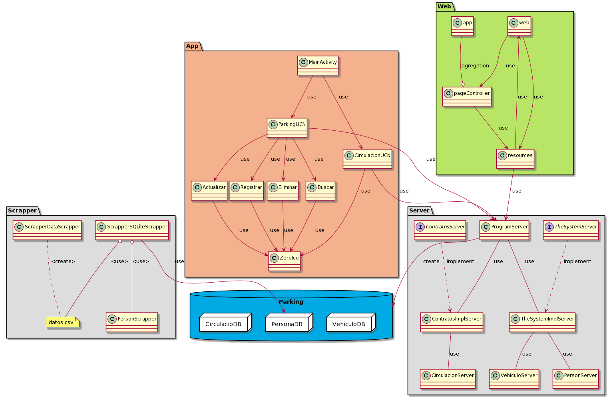

# ParkingUCN
- **Course**: Proyecto Desarrollo e Integración de Soluciones.
- **Degree**: Ingeniería en Computación e Informática.

## Description
- Este es un proyecto de ejemplo básico para comenzar el proyecto ParkingUCN con webScrapping, usando tecnologías como php,
java, zeroIce y android para su desarrollo. 

##  Status
- En desarrollo. 

##  Technologies
  - JavaJDK11 1.8
  - JavaSDK 14.0.1
  - PHP 7.3.7
  - C# 8
  - .NET Core 3.1
  - Laravel 7.16.0
  - Intellij Idea 2020.2.1
  - Android Studio 4.1 Cannary 10
  - HTML, CSS, Javascript
  - Gradle 6.6
  - ZeroIce 3.7.4
  - ORMLite 5.1 + JUunit 5.7.0
  - SQLite 3.32.3.1 
  - Visual Studio Code-Insiders 1.48.0

## Developers
 - [Javier Zuleta-Silva -jzuletas005@gmail.com]().
 - [Beatriz Álvarez-Rojas - bar011@Alumnos.ucn.cl]().
 - [Gonzalo Nieto-Berrios -gnb001@alumnos.ucn.cl ]().

## UML

  

<!--
@startuml
package "Scrapper" #DDDDDD {
  class PersonScrapper{
}
class ScrapperDataScrapper{
}
class ScrapperSQLiteScrapper{
}
note "datos.csv" as N1
ScrapperDataScrapper ..N1:<create>
ScrapperSQLiteScrapper o--N1:<use>
ScrapperSQLiteScrapper o--PersonScrapper:<use>
}
package "Server" #DDDDDD {
  interface TheSystemServer{
}
interface ContratosServer{
}
class CirculacionServer{
}
class VehiculoServer{ 
}
enum SexoServer{
}
class PersonServer{
}
class ContratosImplServer{
}
class TheSystemImplServer{
}
class ProgramServer{
}
ProgramServer--TheSystemImplServer: use
ProgramServer--ContratosImplServer: use
ContratosImplServer--PersonServer:use
ContratosImplServer--VehiculoServer:use
ContratosImplServer--CirculacionServer:use
TheSystemServer..|>TheSystemImplServer:implement
ContratosServer..|>ContratosImplServer:implement
SexoServer--PersonServer:use
}
package Parking <<Database>> #00aae4 {
 package VehiculoDB <<Node>> {
 }
 package PersonaDB <<Node>> {
 }
 package CirculacioDB <<Node>> {
 }
}
ProgramServer -- Parking: create
ScrapperSQLiteScrapper -- PersonaDB: use
@enduml
-->
