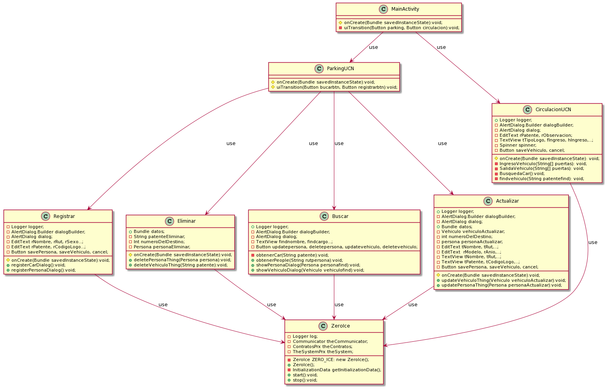

# ParkingUCN
- **Course**: Proyecto Desarrollo e Integración de Soluciones.
- **Degree**: Ingeniería en Computación e Informática.

## Description
- Este modulo crea una aplicación movil la cual se mantendrá conectada con el servidor mediante la conexión que provee ZeroIce

## Libraries

- ZeroIce 3.7.4
- SLF4J   1.7.30
- Logback 1.3.0
- Compression 1.20
- AppCompact 1.1.0
- JUnit 5.7.0

## UML

<!---
@startuml
class MainActivity {
#onCreate(Bundle savedInstanceState):void;
-uiTransition(Button parking, Button circulacion):void;
}
class ParkingUCN{
#onCreate(Bundle savedInstanceState):void;
#uiTransition(Button bucarbtn, Button registrarbtn):void;
}
class Registrar{
-Logger logger;
-AlertDialog.Builder dialogBuilder;
-AlertDialog dialog;
-EditText rNombre, rRut, rSexo...;
-EditText rPatente, rCodigoLogo...;
-Button savePersona, saveVehiculo, cancel;
#onCreate(Bundle savedInstanceState):void;
+registerCarDialog():void;
+registerPersonaDialog():void;
}
class ZeroIce{
-Logger log;
-ZeroIce ZERO_ICE: new ZeroIce();
-Communicator theCommunicator;
-ContratosPrx theContratos;
-TheSystemPrx theSystem;
+ZeroIce();
-InitializationData getInitializationData();
+start():void;
+stop():void;
}
class Eliminar{
+Bundle datos;
-String patenteEliminar;
-Int numeroDelDestino;
-Persona personaEliminar;
#onCreate(Bundle savedInstanceState):void;
+deletePersonaThing(Persona persona):void;
+deleteVehiculoThing(String patente):void;
}
class Buscar{
+Logger logger;
-AlertDialog.Builder dialogBuilder;
-AlertDialog dialog;
-TextView findnombre, findcargo...;
-Button updatepersona, deletepersona, updatevehiculo, deletevehiculo;
-obtenerCar(String patente):void;
+obtenerPeople(String rutpersona):void;
+showPersonaDialog(Persona personafind):void;
+showVehiculoDialog(Vehiculo vehiculofind):void;
}
class Actualizar{
+Logger logger;
-AlertDialog.Builder dialogBuilder;
-AlertDialog dialog;
+Bundle datos;
-Vehiculo vehiculoActualizar;
-int numeroDelDestino;
-persona personaActualizar;
-EditText tNombre, tRut,...;
-EditText  rModelo, rAnio,...;
-TextView tNombre, tRut,...;
-TextView tPatente, tCodigoLogo,...;
-Button savePersona, saveVehiculo, cancel;
#onCreate(Bundle savedInstanceState):void; 
+updateVehiculoThing(Vehiculo vehiculoActualizar):void;
+updatePersonaThing(Persona personaActualizar):void;
}
class CirculacionUCN {
+ Logger logger;
-AlertDialog.Builder dialogBuilder;
-AlertDialog dialog;
-EditText rPatente, rObservacion;
-TextView tTipoLogo, fIngreso, hIngreso,...;
-Spinner spinner;
-Button saveVehiculo, cancel;
#onCreate(Bundle savedInstanceState): void;
-IngresoVehiculo(String[] puertas): void;
-SalidaVehiculo(String[] puertas): void; 
-BusquedaCar():void;
-findvehiculo(String patentefind): void;
} 
MainActivity--|>ParkingUCN:use
MainActivity--|>CirculacionUCN:use
ParkingUCN--|>Registrar:use
ParkingUCN--|>Eliminar:use
ParkingUCN--|>Buscar:use
ParkingUCN--|>Actualizar:use
Registrar--|>ZeroIce:use
Eliminar--|>ZeroIce:use
Buscar--|>ZeroIce:use
Actualizar--|>ZeroIce:use
CirculacionUCN--|>ZeroIce:use
@enduml
--->
