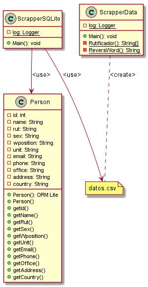

# ParkingUCN
- **Course**: Proyecto Desarrollo e Integración de Soluciones.
- **Degree**: Ingeniería en Computación e Informática.

## Description
- Este modulo captura datos del Directorio de la UCN y encuentra los RUT de ellos por medio de NombreRutyFirma 

## Java Libraries
- SLF4J: org.slf4j:slf4j-api
- Logback: ch.qos.logback:logback-classic
- Jsoup: org.jsoup:jsoup
- ORMLite: com.j256.ormlite:ormlite
- SQLite: org.xerial:sqlite
- ZeroIce: com.zeroc:ice

## Class Domain

@startuml
class Person{

- id: int
- name: String
- rut: String
- sex: String
- wposition: String
- unit: String
- email: String
- phone: String
- office: String
- address: String
- country: String

+ Person(): ORM Lite
+ Person()
+ getId()
+ getName()
+ getRut()
+ getSex()
+ getWposition()
+ getUnit()
+ getEmail()
+ getPhone()
+ getOffice()
+ getAddress()
+ getCountry()

}

class ScrapperData{

- {static}log: Logger

+ Main(): void
- {static}Rutificador(): String[]
- {static}ReversWord(): String

}

class ScrapperSQLite{

- {static}log: Logger
+ Main(): void
}

note "datos.csv" as N1

ScrapperData ..N1:<create>
ScrapperSQLite -->N1:<use>
ScrapperSQLite -->Person:<use>

@enduml