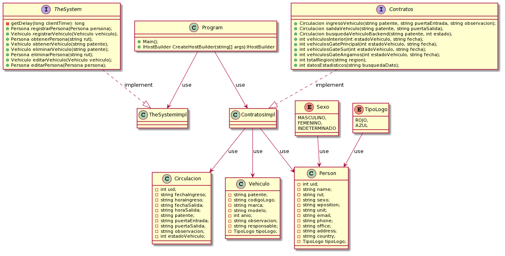

# ParkingUCN
- **Course**: Proyecto Desarrollo e Integración de Soluciones.
- **Degree**: Ingeniería en Computación e Informática.

## Description
- Este modulo crea y mantiene la base de datos que dará soporte a todo el proyecto

## Java Libraries
#### Microsoft
- Microsoft.EntityFrameworkCore Version 3.1.4
- Microsoft.Extensions.Hosting Version 3.1.4
- Microsoft.EntityFrameworkCore.Sqlite Version 3.1.4
- Microsoft.Extensions.DependencyInjection Version 3.1.4
- Microsoft.Extensions.Logging Version 3.1.4
- Microsoft.Extensions.Logging.Console Version 3.1.4

####ZeroIce
- zeroc.ice.net Version 3.7.3.2
- zeroc.icebuilder.msbuild Version 5.0.4

## UML

@startuml
interface TheSystem{
- getDelay(long clientTime): long
}

interface Contratos{

+Persona registrarPersona(Persona persona);
+Vehiculo registrarVehiculo(Vehiculo vehiculo);
+Persona obtenerPersona(string rut);
+Vehiculo obtenerVehiculo(string patente);
+Vehiculo eliminarVehiculo(string patente);
+Persona eliminarPersona(string rut); 
}

class Circulacion {

- int uid;
- string fechaIngreso;
- string fechaSalida;
- string patente;
}

class Vehiculo{ 
-int uid;
-string patente;
-string marca;
-string modelo;
-int anio;
-string observacion;
-string responsable;
}

enum Sexo{
MASCULINO,
FEMENINO
}

class Person{

- int uid;
- string name; 
- string rut; 
- string sexo; 
- string wposition;
- string unit;
- string email; 
- string phone; 
- string office; 
- string address;
- string country;
}

class ContratosImpl{

}

class TheSystemImpl{

}

class Program{

+Main();
+IHostBuilder CreateHostBuilder(string[] args):IHostBuilder

}
Program-->TheSystemImpl: use
Program-->ContratosImpl: use
ContratosImpl-->Person:use
ContratosImpl-->Vehiculo:use
ContratosImpl-->Circulacion:use
TheSystem..|>TheSystemImpl:implement
Contratos..|>ContratosImpl:implement
Sexo-->Person:use
@enduml